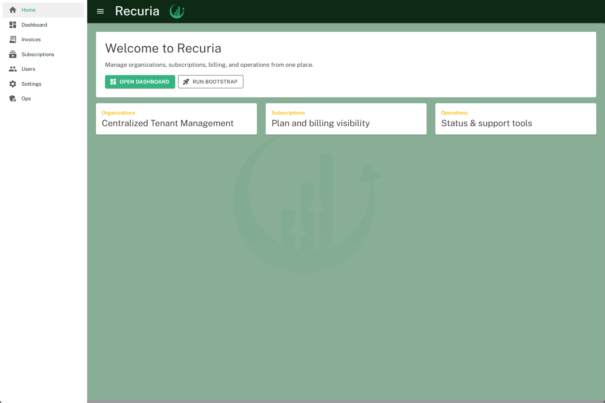
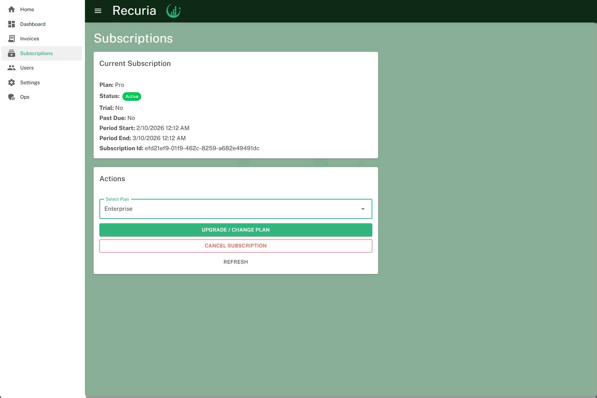
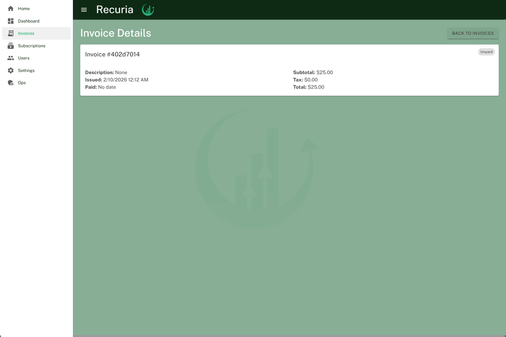
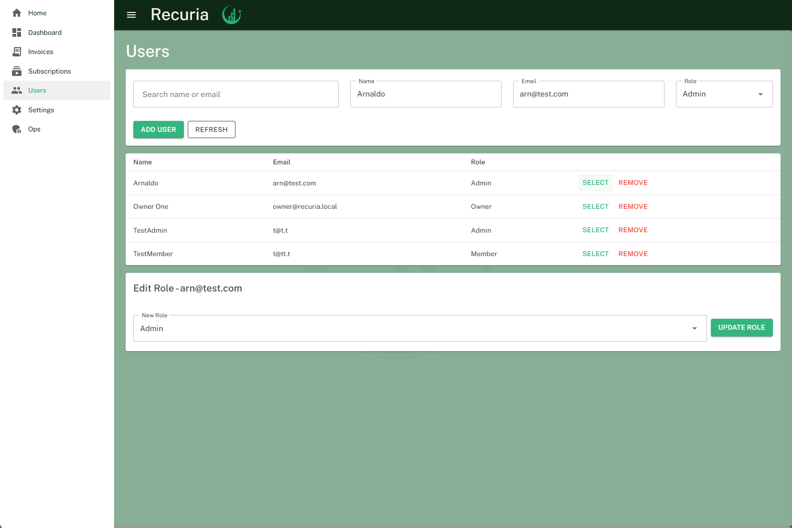
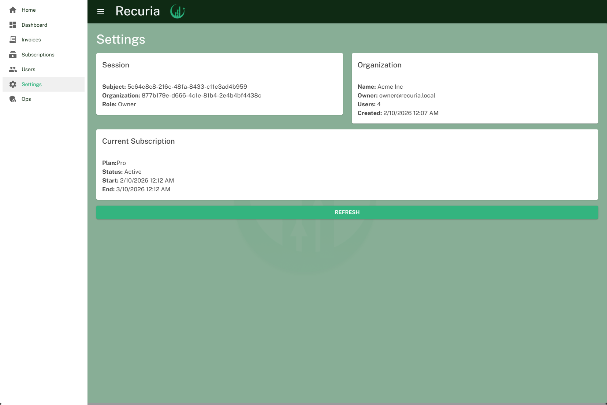
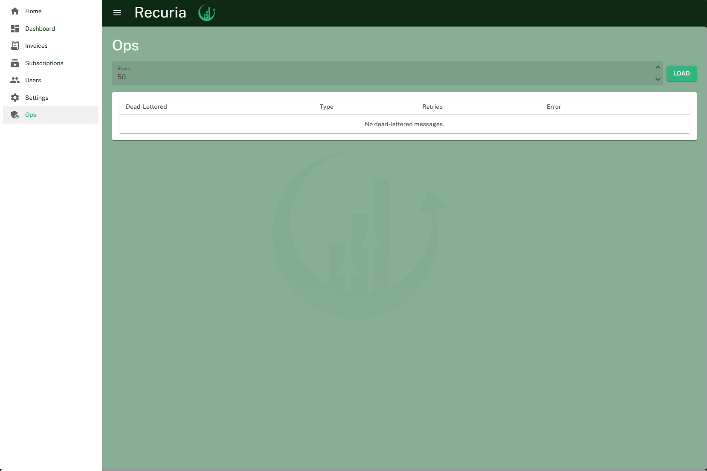

# Recuria

Recuria is a **SaaS subscription and billing platform** built with **ASP.NET Core (.NET 8)**.

It models real-world SaaS business rules including organization ownership, subscription lifecycles, role-based access, billing, invoicing, and observability.

This project is designed as a **industry-aligned system** emphasizing domain modeling, correctness, and testability rather than simple CRUD operations.

---

## Recent Features Implemented

- JWT auth with role‑based policies (Owner/Admin/Member)
- Dev bootstrap endpoint for local JWT + org setup
- Standardized ProblemDetails error responses + correlation IDs
- Rate limiting + request size limits
- Swagger/OpenAPI with JWT security
- Health checks (liveness + readiness with DB)
- Outbox retries + dead‑letter handling + admin inspection/retry endpoints
- CORS + enterprise security headers (CSP, Permissions‑Policy, HSTS)
- Structured JSON logging (Serilog) + audit logging for sensitive actions
- CI pipeline for build/test + migration script generation
- Data integrity indexes + row‑version concurrency
- Invoice create idempotency with key replay, conflict detection, TTL, and purge endpoint

---

## Purpose

Recuria simulates the backend architecture of a modern SaaS product that supports:

- Organization-based accounts
- Role-based user management
- Subscription lifecycle management  
  *(trial → active → past-due → canceled → expired)*
- Plan upgrades with enforced business invariants
- Automated billing cycles with retry and grace periods
- Invoice generation
- Event-driven workflows using domain events and the outbox pattern
- Built-in observability (logging, metrics, tracing)

The goal is to demonstrate **professional backend engineering practices** suitable for backend or full-stack roles.

---

## Architecture

Recuria follows a **Clean Architecture / DDD-inspired structure**, with strict separation of concerns.

```text
Recuria
│
├── Recuria.Domain          // Core domain entities & business rules
├── Recuria.Application     // Use cases, services, interfaces
├── Recuria.Infrastructure  // EF Core, persistence, background services
├── Recuria.Api             // ASP.NET Core Web API
├── Recuria.Blazor          // Blazor WebAssembly frontend (in progress)
└── Recuria.Tests           // Unit & integration tests
```
---

## Architectural Principles

- Domain logic is isolated from frameworks and persistence
- Business rules are enforced in domain entities and services
- EF Core is configured explicitly (no convention-only modeling)
- Domain events drive side effects and workflows
- Outbox pattern ensures reliable, eventually consistent processing
- Background services handle billing, retries, and outbox dispatch
- Observability is treated as a first-class concern

---

## Domain Model

### Core Entities

#### Organization
- Owns users and subscriptions
- Enforces ownership rules
- Determines the currently active subscription

#### User
- Belongs to exactly one organization
- Has a role: `Owner`, `Admin`, or `Member`

#### Subscription
- Belongs to an organization
- Tracks plan and billing period
- Lifecycle states:
  - `Trial`
  - `Active`
  - `PastDue`
  - `Canceled`
  - `Expired`
- Emits domain events on state transitions  
  *(e.g., `SubscriptionActivatedDomainEvent`)*

#### Invoice
- Generated from subscriptions
- Represents billable charges

#### BillingAttempt & OutboxMessage
- Persist billing attempts and domain events
- Enable retries, idempotency, and resilience

---

## Business Rules & Invariants

Recuria enforces realistic SaaS constraints **in code**, not just the database:

- An organization must always have **one Owner**
- Owners cannot be removed or demoted
- Users cannot belong to multiple organizations
- Only one active subscription per organization
- Subscriptions cannot be upgraded once canceled or expired
- Trial subscriptions have a fixed duration
- Billing only occurs for active subscriptions
- Grace periods apply before cancellation
- Domain events are persisted reliably via the outbox pattern

---

## Billing & Subscription Lifecycle

- Automated billing cycles per subscription
- Grace periods before cancellation for past-due subscriptions
- Retry policies for failed billing attempts
- Centralized lifecycle orchestration:
  - Trial expiration
  - Active billing and renewal
  - Past-due handling
  - Cancellation after grace period
- Domain events emitted for activation, expiration, and cancellation

### Invoice Idempotency Contract

`POST /api/invoices` now enforces idempotent create behavior using the `Idempotency-Key` header.

- `Idempotency-Key` header is required
- Same key + same payload within TTL returns `200 OK` with the existing `invoiceId`
- Same key + different payload within TTL returns `409 Conflict`
- New key or expired key returns `201 Created`
- Idempotency keys are retained for a configurable TTL window (`Idempotency:InvoiceCreateTtlHours`)
- Ops purge endpoint is available at `POST /api/outbox/idempotency/purge?olderThanHours=...`

---

## Frontend Features Implemented

The Blazor WebAssembly frontend is now actively implemented with a MudBlazor UI layer.

### UI Foundation
- MudBlazor integrated for layout, components, forms, tables, alerts, chips, skeleton loaders
- Responsive app shell with:
  - Top app bar
  - Drawer navigation
  - Recuria branding (title + logo)
- Role-aware navigation:
  - `Ops` nav item shown only to `Owner` / `Admin`
- Scoped page styling via `.razor.css` where needed

### Implemented Pages
- **Home**
  - Branded welcome surface with quick actions
  
- **Bootstrap**
  - Tenant bootstrap form (org + owner setup)
  - Submits bootstrap request and stores auth context for local dev flow
- **Dashboard**
  - Organization + subscription summary cards
  - Status chips and loading/error states
  
- **Subscriptions**
  - View current plan/status/period
  - Trial creation (where applicable)
  - Plan upgrade/change
  - Cancel subscription (including trial support)
  - Refresh and action-state handling
  
- **Invoices**
  - Invoice list table by organization
  - Create invoice flow
  - View details navigation
  
- **Invoice Details**
  - Issued/paid timestamps
  - Subtotal/tax/total
  - Status display
  - Description support (backend + contract dependent)
  
- **Users**
  - Add user form
  - User table/search workflow (name/email)
  - Role update and remove actions
  
- **Settings**
  - Current auth/session context (`whoami`)
  - Organization and subscription summary
  
- **Ops**
  - Dead-letter outbox inspection
  - Retry action from UI for operational recovery
  

### UX / Interaction Improvements
- Consistent loading, success, and error states across pages
- Handling of API contract mismatches during transition (e.g., 200 vs 201/204)
- Localized date/time display patterns using `CurrentCulture` where appropriate
- Typed frontend app-service layer (`Services/App`) to avoid page-direct API calls
- Centralized notification + error mapping via `ApiCallRunner`
- Role-aware UI authorization across nav, pages, and sensitive actions
- Graceful forbidden states with actionable messaging (`ForbiddenState`)
- MudForm-driven field validation + server validation mapping on key forms
- Confirmation dialogs for destructive operations (cancel/remove/retry flows)

### Frontend Runtime Notes
- Frontend is a browser-hosted Blazor WASM app, not a desktop executable
- Production deployment requires:
  - Static hosting for frontend
  - Always-on API backend
  - Correct `ApiBaseUrl` and CORS configuration

---

## Observability

### Logging
- Structured logs across domain logic, billing, and background jobs
- Serilog JSON output with correlation IDs (`X-Correlation-Id`)

### CORS & Security Headers
- Configure allowed origins in `Recuria.Api/appsettings.json`
- Security headers are enabled by default (CSP, Permissions-Policy, etc.)

### Metrics
- Prometheus-compatible metrics for:
  - Subscription counts
  - Billing success/failure
  - Retry attempts

### Tracing
- OpenTelemetry tracing for:
  - HTTP requests
  - EF Core queries
  - Background services

### Runtime Instrumentation
- CPU, memory, GC, thread, and process metrics

---

## Testing

Testing focuses on **business behavior**, not implementation details.

### Unit Test Coverage

- **Organization domain/service behavior**
  - Owner invariants
  - Role constraints
  - Domain event emission
  - Files:
    - `Recuria/Recuria.Tests/Unit/Domain/OrganizationServiceTests.cs`
    - `Recuria/Recuria.Tests/Unit/Domain/OrganizationSubscriptionInvoiceTests.cs`

- **Subscription lifecycle and rules**
  - Trial creation and activation
  - Upgrade/cancel constraints
  - Expiration and overdue transitions
  - Files:
    - `Recuria/Recuria.Tests/SubscriptionServiceTests.cs`
    - `Recuria/Recuria.Tests/SubscriptionLifecycleOrchestratorTests.cs`

- **Billing behavior**
  - Invoice creation per cycle
  - Overdue handling and grace behavior
  - Failure/retry-oriented behavior
  - File:
    - `Recuria/Recuria.Tests/BillingServiceTests.cs`

- **DI/Wiring diagnostics**
  - Container wiring and handler registration checks
  - File:
    - `Recuria/Recuria.Tests/DI/DiWiringDiagnosticsTests.cs`

- **Frontend service layer and UX orchestration**
  - App-service success/failure mapping for auth, users, org, subscriptions, invoices, ops
  - 204-compat contract handling tests (role change/remove/retry/logout)
  - User context role-capability mapping and cache behavior
  - Centralized API error mapping coverage (`401/403/404/409/500`)
  - Files:
    - `Recuria/Recuria.Tests/Unit/Frontend/ApiCallRunnerTests.cs`
    - `Recuria/Recuria.Tests/Unit/Frontend/AuthAppServiceTests.cs`
    - `Recuria/Recuria.Tests/Unit/Frontend/UserAppServiceTests.cs`
    - `Recuria/Recuria.Tests/Unit/Frontend/OrganizationAppServiceTests.cs`
    - `Recuria/Recuria.Tests/Unit/Frontend/SubscriptionAppServiceTests.cs`
    - `Recuria/Recuria.Tests/Unit/Frontend/InvoiceAppServiceTests.cs`
    - `Recuria/Recuria.Tests/Unit/Frontend/OpsAppServiceTests.cs`
    - `Recuria/Recuria.Tests/Unit/Frontend/UserContextServiceTests.cs`

### Integration Test Coverage

- **Authorization boundaries**
  - Org-claim mismatch checks for organization, subscription, and invoice endpoints
  - File:
    - `Recuria/Recuria.Tests/IntegrationTests/Auth/AuthorizationTests.cs`

- **Auth identity contract**
  - `/api/auth/whoami` payload and claims shape
  - File:
    - `Recuria/Recuria.Tests/IntegrationTests/Auth/WhoAmITests.cs`

- **Organization workflows**
  - Create organization
  - Add user / change role / remove user
  - Rollback behavior on domain event handler failure
  - Users listing by organization (`GET /api/organizations/{id}/users`)
  - Files:
    - `Recuria/Recuria.Tests/IntegrationTests/Organizations/OrganizationFlowTests.cs`
    - `Recuria/Recuria.Tests/IntegrationTests/Organizations/OrganizationRollbackTests.cs`
    - `Recuria/Recuria.Tests/IntegrationTests/Organizations/OrganizationUsersListTests.cs`
    - `Recuria/Recuria.Tests/IntegrationTests/Organizations/OrganizationCreatesTrialSubscriptionTests.cs`

- **Subscription workflows**
  - Trial provisioning flow
  - Trial cancellation path
  - Expiration behavior and related events
  - Files:
    - `Recuria/Recuria.Tests/IntegrationTests/Subscriptions/SubscriptionFlowTests.cs`
    - `Recuria/Recuria.Tests/IntegrationTests/Subscriptions/SubscriptionActionsTests.cs`
    - `Recuria/Recuria.Tests/IntegrationTests/Subscriptions/SubscriptionExpirationTests.cs`
    - `Recuria/Recuria.Tests/IntegrationTests/Subscriptions/SubscriptionActivationTests.cs`

- **Invoice workflows**
  - Details retrieval authorization and payload correctness
  - Description persistence and retrieval
  - Mark-as-paid endpoint behavior (`PaidOnUtc`)
  - Idempotent invoice create behavior:
    - Missing key returns `400`
    - Same key and same payload replay behavior
    - Same key and different payload conflict behavior
    - Expired key reuse behavior
  - File:
    - `Recuria/Recuria.Tests/IntegrationTests/Invoices/InvoiceFlowTests.cs`
    - `Recuria/Recuria.Tests/IntegrationTests/Invoices/InvoiceContractTests.cs`
    - `Recuria/Recuria.Tests/IntegrationTests/Invoices/InvoiceIdempotencyTests.cs`

- **Ops/Outbox authorization**
  - Role-based access checks for dead-letter listing and retry
  - File:
    - `Recuria/Recuria.Tests/IntegrationTests/Ops/OutboxAuthorizationTests.cs`

- **Error handling contracts**
  - ProblemDetails shape and consistency
  - File:
    - `Recuria/Recuria.Tests/IntegrationTests/ErrorHandling/ProblemDetailsTests.cs`

### Test Command

```bash
dotnet test Recuria/Recuria.Tests/Recuria.Tests.csproj
```

### Additional Planned Coverage

- Blazor component-level tests (bUnit) for key pages (`Subscriptions`, `Invoices`, `Users`)
- API schema stability checks for OpenAPI/NSwag contract drift
- End-to-end smoke tests for bootstrap -> subscription -> invoice lifecycle

### Testing Stack

- xUnit
- FluentAssertions
- Moq (where appropriate)
- Integration tests using real EF Core contexts

---

## Quality Gates

Recuria uses explicit quality gates so changes are not considered complete unless they pass build, tests, and contract consistency checks.

### Required Gates (PR / main branch)

1. **Build must pass**
- API, Application, Domain, Infrastructure, and Tests compile without errors.

2. **Tests must pass**
- Unit + integration tests pass on CI.
- New behavior requires new/updated tests.

3. **Migrations must be valid**
- EF migration files compile.
- Database update path is verified for new schema changes.

4. **API contract must stay in sync**
- OpenAPI document reflects current API behavior.
- NSwag client is regenerated when API contracts change (status codes, DTOs, routes).

5. **Security constraints must remain enforced**
- Authorization policies remain covered by tests (Owner/Admin/Member boundaries).
- Org-scoped endpoints enforce `org_id` claim checks.
- Invoice create idempotency contract remains enforced (`400/200/409/201` paths).

---

## CI Checklist

Use this checklist before merging:

- [ ] `dotnet restore`
- [ ] `dotnet build Recuria/Recuria.Api/Recuria.Api.csproj`
- [ ] `dotnet test Recuria/Recuria.Tests/Recuria.Tests.csproj`
- [ ] Verify invoice idempotency flows:
  - Missing `Idempotency-Key` returns `400`
  - Replayed same key and payload returns `200` with same `invoiceId`
  - Replayed same key and different payload returns `409`
- [ ] `dotnet ef migrations add <Name> --project Recuria/Recuria.Infrastructure/Recuria.Infrastructure.csproj --startup-project Recuria/Recuria.Api/Recuria.Api.csproj` (only when schema changes)
- [ ] `dotnet ef database update --project Recuria/Recuria.Infrastructure/Recuria.Infrastructure.csproj --startup-project Recuria/Recuria.Api/Recuria.Api.csproj` (validate migration path)
- [ ] Refresh OpenAPI:  
      `Invoke-WebRequest http://localhost:5132/swagger/v1/swagger.json -OutFile api/openapi.json`
- [ ] Regenerate client:  
      `dotnet nswag run nswag.json`
- [ ] Rebuild client and frontend:
  - `dotnet build Recuria/Recuria.Client/Recuria.Client.csproj`
  - `dotnet build Recuria/Recuria.Blazor/Recuria.Blazor.csproj`

---

## Definition of Done (Engineering)

A change is done when:

- Behavior is implemented and reviewed
- Relevant tests are added/updated and passing
- API/NSwag contracts are synchronized
- Documentation (README and screenshots when applicable) is updated
- No known regression is introduced in authorization, tenancy boundaries, or billing/subscription invariants
---

## Technology Stack

- **.NET 8 / C# 12**
- **ASP.NET Core Web API**
- **Entity Framework Core 10**
- **SQL Server**
- **Blazor WebAssembly** 
- **OpenTelemetry** (Prometheus / OTLP)
- **xUnit + FluentAssertions**

---

## Getting Started

### Prerequisites

- .NET SDK 8+
- SQL Server (local instance or Docker)
- Visual Studio 2022+ or VS Code

### Setup

```bash
dotnet restore
dotnet ef database update --project Recuria.Infrastructure
dotnet run --project Recuria.Api
```

---

## Secrets management (free + easy)
Local development:
```bash
dotnet user-secrets init --project Recuria.Api
dotnet user-secrets set "ConnectionStrings:DefaultConnection" "<your-connection-string>" --project Recuria.Api
dotnet user-secrets set "Jwt:Issuer" "Recuria" --project Recuria.Api
dotnet user-secrets set "Jwt:Audience" "Recuria.Api" --project Recuria.Api
dotnet user-secrets set "Jwt:SigningKey" "CHANGE_ME_DEV_KEY" --project Recuria.Api
```

Production (environment variables):
```
ConnectionStrings__DefaultConnection
Jwt__Issuer
Jwt__Audience
Jwt__SigningKey
Cors__AllowedOrigins__0
SecurityHeaders__ContentSecurityPolicy
SecurityHeaders__PermissionsPolicy
```

---

## Disaster recovery (DR)
Targets (example):
- RPO: 15 minutes
- RTO: 1 hour

Automated backup scripts:
- `scripts\backup-db.ps1`
- `scripts\restore-db.ps1`

Env vars required:
```
RECURIA_SQL_SERVER
RECURIA_SQL_DATABASE
RECURIA_SQL_BACKUP_PATH
RECURIA_SQL_BACKUP_FILE
```

Run a restore drill quarterly (staging or isolated environment).
